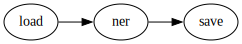
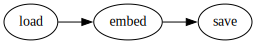

# Blueprint POC AI

## Introduction

This project lays out the architecture of the ML2Grow AI project. This project was instantiated in order to leverage the power of AI in current and future LBLOD projects.
This blueprint was meant to lay bare this architecture to make potential improvements apparent.
[...]

## Models

The project uses multiple models throughout the project to achieve various functionalities. These models and their functionalities will be listed out here.
[...]

### NER - Named Entity Recognition

[NER](https://pypi.org/project/flair/) is used to recognize various entities within sentences. For example, using the sentence "I love Berlin.", the model will recognize that Berlin is most likely a location. This can be useful for tagging entities within sentences. So these can be used for linking to related topics and such.
[...]

### BERTopic

[BERTopic](https://pypi.org/project/bertopic/) is used for identifying topics within a certain article. For example, [...].

### Embed

This models links an embedding vector to a document based on its content. This vector can later be used to perform elastic search.

### Zeroshot

This model will be used to perform classifications on BBC Topics. These BBC topics are a way of classifying documents based on the content and matter addressed in the document.

## Apache Airflow architecture

[Apache Airflow](https://airflow.apache.org/docs/) is a framework used to deploy Big Data Networks that can be used amongst multiple projects. There are certain containers that contain various scripts that can be run from CLI. These scripts perform various important tasks such as saving and loading models or data.
[...]

## DAGs - Directed Acyclic Graphs

[DAGs](https://airflow.apache.org/docs/apache-airflow/stable/concepts/dags.html) [...]  
DAGS configure the containers that run the various tasks of the project.

### NER



[Link to the repository containing the scripts](https://github.com/lblod/poc-ai-airflow-ner)
During these tasks. We first load the NER model. Then we perform NER related stuff.

1. [Load](https://github.com/lblod/poc-ai-airflow-ner/blob/master/scripts/load.py)  
    During this script we load the data from the triplestore and export it to a json file. This file can then later be used to perform transformations. This script loads following query

    ```sparql
        PREFIX prov: <http://www.w3.org/ns/prov#>
        PREFIX dct: <http://purl.org/dc/terms/>
        PREFIX soic: <http://rdfs.org/sioc/ns#>
        PREFIX ext: <http://mu.semte.ch/vocabularies/ext/>


        SELECT DISTINCT ?thing ?text WHERE {
            ?thing a <http://rdf.myexperiment.org/ontologies/base/Submission>; 
            prov:generated/dct:hasPart ?part.    
            ?part soic:content ?text.  
            FILTER NOT EXISTS {  ?thing ext:ingestedml2GrowSmartRegulationsNer "1" }
        }
    ```

2. [NER](https://github.com/lblod/poc-ai-airflow-ner/blob/master/scripts/ner.py)  
    Afterwards we use the data to run the NER model on. The data gets processed and the results are written to a json file on disk.

3. [Save](https://github.com/lblod/poc-ai-airflow-ner/blob/master/scripts/save.py)  
    Finally the results are persisted in the triplestore. The results are saved in the triplestore like this.

    _NER: <http://data.lblod.info/ners/{UUID}>_
    Property | Description
    ---|---
    Type |  A constant value being ext:Ner. Representing the type of the subject.
    start   | The start position of the word. Relative to [...].
    end | The end position of the word. Relative to [...].
    word    | The word that was guessed on by the AI model.
    entity  | Can be either "Location", "Person" or "Organization". This is the value guessed by the AI model.

    Additionally we also add a predicate to the file that was used to generate the NER with.

    _File_
    Property | Description
    ---|---
    hasNer | A link to the NER associated with the document
    ingestedml2GrowSmartRegulationsNer | Tag indicating it has already been ingested for future runs of the model.

### BERTopic Retrain

  

[Link to the repository containing the scripts](https://github.com/lblod/poc-ai-airflow-bertopic)  

1. [Load](https://github.com/lblod/poc-ai-airflow-bertopic/blob/master/scripts/load.py)
    Script that loads the following query.

    ```sparql
        PREFIX prov: <http://www.w3.org/ns/prov#> 
        PREFIX dct: <http://purl.org/dc/terms/>  
        PREFIX soic: <http://rdfs.org/sioc/ns#>  
        PREFIX ext: <http://mu.semte.ch/vocabularies/ext/>  
        
        SELECT DISTINCT ?thing ?part ?text WHERE {
            ?thing a <http://rdf.myexperiment.org/ontologies/base/Submission>; 
            prov:generated/dct:hasPart ?part.    
            ?part soic:content ?text.  
        }
    ```

2. [Retrain & Save](https://github.com/lblod/poc-ai-airflow-bertopic/blob/master/scripts/retrain.py)  
    [...]
3. Restart  
    [...]
4. [Transform](https://github.com/lblod/poc-ai-airflow-bertopic/blob/master/scripts/transform.py)  
    [...]
5. Save
   1. [Transform](https://github.com/lblod/poc-ai-airflow-bertopic/blob/master/scripts/save_transform.py)

        _Topic: <http://data.lblod.info/ML2GrowTopicModeling/topic/{UUID}>_
        Property | Description
        ---|---
        Type | isTopic
        relevant_words | The relevant words found by the model.
        count | The count of [...]
        topic_label | The label of the topic

   2. [Topics](https://github.com/lblod/poc-ai-airflow-bertopic/blob/master/scripts/save_topics.py)

        _File_
        Property | Description
        ---|---
        HasTopic | URI to the linked topic.
        ingestedByMl2GrowSmartRegulationsTopics | Tag indicating it has been ingested by a ML2Grow model.

        _Topic Score: <http://data.lblod.info/ML2GrowTopicModeling/{UUID}>_
        Property | Description
        ---|---
        Type | TopicScore
        TopicURI | URI to the linked topic
        score | score of the linked topic

### BERTopic Transform


[Link to the repository containing these scripts](https://github.com/lblod/poc-ai-airflow-bertopic)

1. [Load](https://github.com/lblod/poc-ai-airflow-bertopic/blob/master/scripts/load.py)  
    Initiates the task by loading data from the triplestore.

    ```sparql
        PREFIX prov: <http://www.w3.org/ns/prov#> 
        PREFIX dct: <http://purl.org/dc/terms/>  
        PREFIX soic: <http://rdfs.org/sioc/ns#>  
        PREFIX ext: <http://mu.semte.ch/vocabularies/ext/>  
        
        SELECT DISTINCT ?thing ?part ?text WHERE {
            ?thing a <http://rdf.myexperiment.org/ontologies/base/Submission>; 
            prov:generated/dct:hasPart ?part.    
            ?part soic:content ?text.  
        }
    ```

2. [Transform](https://github.com/lblod/poc-ai-airflow-bertopic/blob/master/scripts/transform.py)  
    [...]
3. [Save](https://github.com/lblod/poc-ai-airflow-bertopic/blob/master/scripts/save_transform.py)
    This script saves the same data as the number 3.1 of the previous section. So you can find this info over there.

### Embed



[Link to the repository containing the scripts](https://github.com/lblod/poc-ai-airflow-embed)

1. [Load](https://github.com/lblod/poc-ai-airflow-embed/blob/master/scripts/load.py)
  
    ```sparql
        PREFIX prov: <http://www.w3.org/ns/prov#>
        PREFIX dct: <http://purl.org/dc/terms/>
        PREFIX soic: <http://rdfs.org/sioc/ns#>
        PREFIX ext: <http://mu.semte.ch/vocabularies/ext/>


        SELECT DISTINCT ?thing ?text WHERE {
            ?thing a <http://rdf.myexperiment.org/ontologies/base/Submission>;
            prov:generated/dct:hasPart ?part.    
            ?part soic:content ?text.  
            FILTER NOT EXISTS {  ?thing ext:ingestedByMl2GrowSmartRegulationsEmbedding "1" }

        }
    ```

2. [Embed](https://github.com/lblod/poc-ai-airflow-embed/blob/master/scripts/embed.py)
3. [Save](https://github.com/lblod/poc-ai-airflow-embed/blob/master/scripts/save.py)

    _File_
    Property | Description
    ---|---
    searchEmbedding | Embedding Vector linked to the file.
    ingestedByMl2GrowSmartRegulationsEmbedding | Tag indicating it has been ingested by a ML2Grow model.

### Zeroshot


[Link to the repository containing the scripts](https://github.com/lblod/poc-ai-airflow-zeroshot)

1. Load  
   1. [Zeroshot](https://github.com/lblod/poc-ai-airflow-zeroshot/blob/master/scripts/load.py)

        ```sparql
            PREFIX prov: <http://www.w3.org/ns/prov#>
            PREFIX dct: <http://purl.org/dc/terms/>
            PREFIX soic: <http://rdfs.org/sioc/ns#>
            PREFIX ext: <http://mu.semte.ch/vocabularies/ext/>
            SELECT DISTINCT ?thing ?text WHERE {
                ?thing a <http://rdf.myexperiment.org/ontologies/base/Submission>; 
                prov:generated/dct:hasPart ?part.    
                ?part soic:content ?text.  
                FILTER NOT EXISTS {  ?thing ext:ingestedMl2GrowSmartRegulationsBBC "1" }
            }
        ```

   2. [Taxo](https://github.com/lblod/poc-ai-airflow-zeroshot/blob/master/scripts/load.py)

        ```sparql
            PREFIX ext: <http://mu.semte.ch/vocabularies/ext/>

            SELECT ?nl WHERE {
                <http://data.lblod.info/ML2GrowClassification> ?o ?taxo.
                ?taxo ext:nl_taxonomy ?nl
            }
        ```

2. [ZS_BBC](https://github.com/lblod/poc-ai-airflow-zeroshot/blob/master/scripts/zeroshot.py)
3. [Save](https://github.com/lblod/poc-ai-airflow-zeroshot/blob/master/scripts/save.py)

    _Zeroshot Classification: <http://data.lblod.info/ML2GrowClassification/score/{UUID}>_
    Property | Description
    ---|---
    Type | One of many values
    score | Score of the models prediction
    BBC_scoring | Result of the BBC classification
    ingestedMl2GrowSmartRegulationsBBC | Tag indicating it has been ingested by a ML2Grow model.

## Data Flow Diagrams

The Data Flow in the project goes a little like this.
[...]

## Triplestore Mapping

SparQL triplestores are used for persisting most data. Though through Airflow there are also mentions of postgreSQL. The use of PostgreSQL can be an inconvenience for the purpose of linking this project to other LBLOD projects.
[...]

## Conclusion

[...]